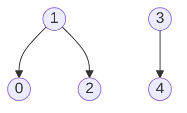

- Algorithm:
	1. Find the connected components that contain the node $s$ using BFS or DFS.
	2. Find a node $v$ (if any) in the graph that is not in any connected component found in step 1.
	3. Repeat step 1 with $v$ as the starting node.
- This algorithm runs in $O(n+m)$ time. (even though it may run BFS or DFS multiple times, it spends a constant amount of time on each edge and node)

