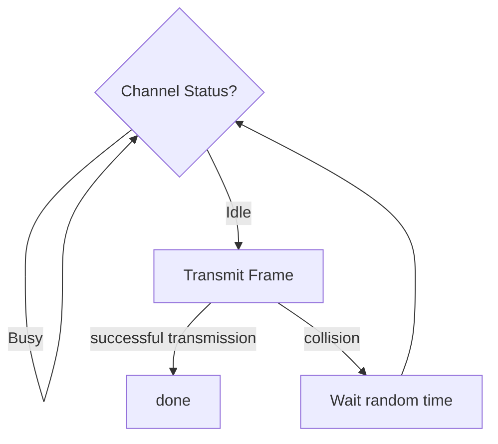
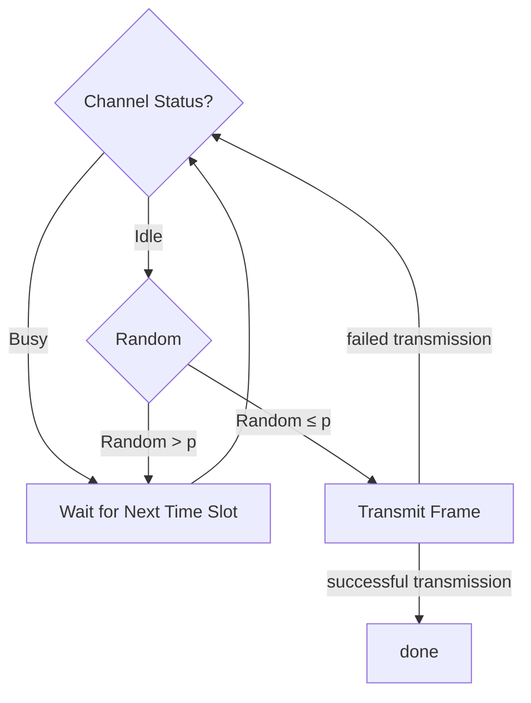
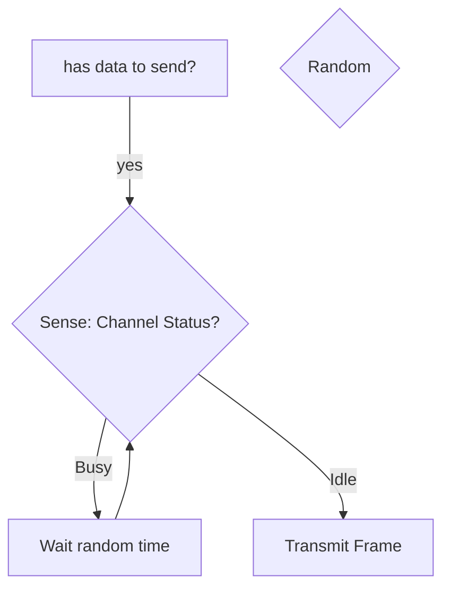

## Signal processing

- **ADC** (analog-to-digital converter) is a device that converts a continuous analog signal to a discrete digital signal
	- **Sampling** converts a continuous-time signal $s(T)$ to a discrete-time signal, a sequence of numbers $s(nT)$, where: 
		- $T$ is the **sampling period** (or **sampling interval**).
		- $f_s = 1/T$  is the **sampling frequency** (or **sampling rate**) which is the number times per second the original analog voltage is measured ("sampled")
	- **Quantization** replaces input values by an approximation from a finite set of values
		- The **resolution** (or **bit depth**) is the number of bits or values for the voltage of each sample (=measurement)
		- The difference between the original continuous analog signal and its digital approximation is called the **quantization error** (or **quantization noise**)
- **DAC** (digital-to-analog converter) is a device that converts a digital signal to an analog signal
	- Spectral band
	- frequency band
	- Digital data
	- A **digital signal** is a signal that represents data as a sequence of discrete values
	- analog signal
	- analog data 

- The **spectrum** $[f_\text{low}, f_\text{high}]$ of a signal is the range of frequencies it contains
- The **center frequency** $f_c$ of a channel is defined in two ways:
	- $f_c = \frac{f_\text{high} + f_\text{low}}{2}$ (arithmetic mean, most common)
	- $f_c = \sqrt{f_\text{high} \cdot f_\text{low}}$ (geometric mean)
- The **(analog) bandwidth** (or **frequency bandwidth**) (רוחב סרט) is the range of frequencies that a channel can transmit, defined as $B = f_\text{high} - f_\text{low}$ (unit: Hz)
	- The **effective bandwidth** refers to the range of frequencies within which a significant portion of the signal's power or energy is concentrated.
- **Fractional bandwidth**: $B_\text{frac} = \frac{B}{f_c}$

- The **symbol rate** (or **baud rate**) $R_s$ is the number of symbols transmitted per unit time 
	- the number of times the signal changes state per second 
	- (unit: baud (Bd) = symbols per second)
- The **symbol duration time** $T_s$ is the time taken to transmit one symbol (unit: seconds)
	- $T_s = \frac{1}{R_s}$

- (**Nyquist's formula**) $R = R_s \cdot \log_2(M) \leq 2B \cdot \log_2 (M)=C$
	- (for a noiseless channel)
	- $R_s$: symbol rate (in $\textsf{baud}$)
	- $M$: modulation order (number of distinct symbols, or distinct amplitude (or phase, or frequency) levels)
	- $R$: bit rate (in $\textsf{bps}$)
	- $N=\log_2(M)$ = number of bits encoded per symbol
	- $B$ is the bandwidth of the channel (Hz)
	- $R_{\text{max}}=2B$ is the **Nyquist rate** (in symbols per second (baud)), which is the maximum symbol rate 
	- $C$ is the channel capacity (in bps) (maximum bit rate)

- The **Nyquist rate** of a signal is defined as $2f_\text{max}$ (in samples per second (Hz)), where $f_\text{max}$ is the highest frequency present in the signal (in Hz)
- The **Nyquist frequency** (in Hz) is defined as $\displaystyle {f_s}/{2}$, where $f_s$ is the sampling rate (in samples per second (Hz)), and is the highest frequency that can be accurately represented when sampling at $f_s$.

- (**Shannon–Hartley theorem**) $C = B \log_2\bigl(1 + \mathrm{SNR}\bigr)$ is the **channel capacity** (in bps) (maximum possible data rate) of a channel with bandwidth $B$ (in Hz) and signal-to-noise ratio $\mathrm{SNR}$
- $C/B$ is the **spectral efficiency** (in bps/Hz)
- $\mathrm{SNR}=\frac{S}{N}$: signal-to-noise ratio (SNR) (unitless)
	- $\mathrm{SNR_{dB}}=10\log_{10}\left( \frac{S}{N} \right)$: signal-to-noise ratio (in dB)
	- $S$: signal power (in watts)
	- $N$: noise power (in watts)

- **Nyquist–Shannon sampling theorem** #todo

- $\displaystyle\frac{\text{data}}{\text{data}+\text{overhead}}$

### modulation 

| Data    | Signal                | Encoding/Conversion Technique                  |
| ------- | --------------------- | ---------------------------------------------- |
| Analog  | Analog                | AM, FM                                         |
| Digital | (Square-wave) digital | NRZ, NRZI, Manchester, Differential Manchester |
| Digital | (Discrete) analog     |                                                |
| Analog  | Digital               |                                                |

## Performance 

#### Bandwidth 

- $\text{data rate}=\frac{\text{data transmitted}}{\text{time taken}}$
- $\text{Bit rate}=\frac{\text{ \# bits transmitted}}{\text{Time taken}}$ (unit: bits per second, bps) 
- The **bit rate** $R$ (קצב נתונים) is the number of bits transmitted per a unit of time (unit: **bps**, bits per second)
- The **data bandwidth** (or **digital bandwidth** or simply **bandwidth**) is the maximum data rate that can be transmitted over a communication channel

###### Throughput

- **Network throughput** (or just **throughput**) (in bps) is a measurement of the average amount of data that _actually_ passes through a network in a specific time frame, taking into account the impact of latency

#### Latency 
$$\text{Latency} = t_{\text{prop}} + t_{\text{tx}} + t_\text{queue}$$
- latency is the amount of time it takes for a packet of data to travel between two points across a network connection
- latency (also called delay (?) #todo) is the time it takes for data to pass from one point on a network to another
- (**Propagation delay**) $t_{\text{prop}} = \frac{d}{s}= \frac{\text{distance}}{\text{speed of signal}}$
- (**Transmission delay**) $t_{\text{tx}} =\frac{L}{R} = \frac{\text{length}\,\textsf{[bits]}}{\text{transmission rate}\,\textsf{[bps]}}$
- (**Queueing delay**)
- (**Processing delay**)
- **round-trip time** (**RTT**) (or (**round-trip delay** (**RTD**)): the time it takes for a signal to travel from the source to the destination and back again
	- $\text{RTT} \approx 2 \times t_{\text{prop}}$

#### Bandwidth-delay product

- The **bandwidth-delay product**, $\text{RTT}  \times \text{bandwidth}$, in bits, is the amount of data that can be in transit in the network at any given time

#### Stop-and-wait

$\displaystyle \text{Throughput}\,\textsf{[bps]} = \frac{\text{frame size}\,\textsf{[bits]} }{\text{RTT}}$

#### File transfer time

- Minimum transfer time: $\text{RTT} + t_{\text{tx}}$

- $T_\text{total} =t_\text{handshake} + t_\text{data}$
	- $t_\text{handshake}=k\times \text{RTT}$, where $k$ is the number of RTTs needed for handshaking
		- $2 \times \text{RTT}$ #todo
	- (Continuous pipeline) $t_\text{data} = N\cdot t_{\text{tx}} + t_{\text{prop}}$ 
	- (Stop-and-wait) $t_\text{data} = (N-1)\cdot (t_{\text{tx}}+\text{RTT}) + t_{\text{tx}} + t_{\text{prop}}$
	- (window-limited) $t_\text{data} = (K-1)\cdot \text{RTT} + t_{\text{prop}}$
		- $K=\left\lceil\frac{N}{W}\right\rceil$ 
		- $W$ is the window size (packets per RTT)
	- $N=\left\lceil\frac{\text{File Size}}{\text{Packet Size}}\right\rceil$ is the number of packets needed to transmit the file

# OSI and TCP/IP models

<table border="1">
  <thead>
    <tr>
      <th></th>
      <th>OSI</th>
      <th>TCP/IP</th>
      <th></th>
    </tr>
  </thead>
  <tbody>
    <tr>
      <td>Data</td>
      <td>Application</td>
      <td style="vertical-align: middle;" align="center" rowspan="3">Application</td>
      <td style="vertical-align: middle;" align="center" rowspan="3">Software</td>
    </tr>
    <tr>
      <td>Data</td>
      <td>Presentation</td>
    </tr>
    <tr>
      <td>Data</td>
      <td>Session</td>
    </tr>
    <tr>
      <td>Segment</td>
      <td>Transport</td>
      <td>Transport</td>
      <td>Hardware/Software</td>
    </tr>
    <tr>
      <td>Packet</td>
      <td>Network</td>
      <td>Internet</td>
      <td style="vertical-align: middle;" align="center" rowspan="3">Hardware</td>
    </tr>
    <tr>
      <td>Frame</td>
      <td>Data Link (קו)</td>
      <td style="vertical-align: middle;" align="center" rowspan="2">Link (or Network Access)</td>
    </tr>
    <tr>
      <td>Bit</td>
      <td>Physical</td>
    </tr>
  </tbody>
</table>

# Link layer

- Link Classification
	- Last-Mile
	- Backbone
	- LAN

- Connection-oriented service
- Connection-less service

## encoding 

- baseline wander

- non-return to zero (NRZ or NRZ‑L): low: 0, high: 1
- non-return to zero inverted (NRZI): change at the start: 1, no change at the start: 0
- Manchester: transition at the midpoint. 
	- (G. E. Thomas) low-to-high: 1, high-to-low: 0
	- (IEEE 802.3) low-to-high: 0, high-to-low: 1
- Differential Manchester: transition at the midpoint. change at the start: 0, no change at the start: 1

## Framing 

- A **frame** 

## Error detection and correction

- A **bit error** is when a bit is received incorrectly (0 instead of 1 or vice versa)
- A **burst error** is when a sequence of bits is received incorrectly
- The **bit error ratio** is defined as $\displaystyle\text{BER} = \frac{\text{\# bit errors}}{\text{Total transmitted bits}}$
- The **bit error probability** is defined as $p_{e}=\mathrm{E}[\text{BER}]$

- error detection:
	- goal: transmit a message $M$ of length $n$ with $k\ll n$ redundant bits $R=f(M)$
	- the sender transmits $(M,R)$. The receiver receives $(M',R')$ and checks if $R' = f(M')$, if yes, assume no error with high probability, else, error detected 
- internet checksum
	- message is divided into words of 16 bits: $w_1, w_2, \ldots, w_m$
	- the checksum is $R = \sim(w_1 + w_2 + \ldots + w_m)$ (where $\sim$ is the bitwise NOT operation. The sum is done using [[Data Storage#Ones' complement|ones' complement addition]])
	- the sender sends $(M,R)$
	- the receiver computes $S = w_1' + w_2' + \ldots + w_m' + R'$ (using ones' complement addition) and checks if $\sim S = 0$, if yes, assume no error, else, error detected
- cyclic redundancy check (CRC) #todo 
- Parity check #todo 

## protocols 
### Stop-and-wait ARQ

### Sliding window protocol

## Ethernet

### Frame format (Ethernet II)

<table>
  <tr>
    <th align="center">8 bytes</th>
    <th align="center">6</th>
    <th align="center">6</th>
    <th align="center">2</th>
    <th align="center">46-1500</th>
    <th align="center">4</th>
  </tr>
  <tr>
    <td align="center">Preamble</td>
    <td align="center">Dest addr</td>
    <td align="center">Src addr</td>
    <td align="center">EtherType</td>
    <td align="center">Payload</td>
    <td align="center">CRC</td>
  </tr>
  <tr>
    <td align="center"></td>
    <td align="center" colspan="3">Header</td>
    <td align="center">Data</td>
    <td align="center">Footer</td>
  </tr>
</table>

#### MAC address

<table style="font-family: monospace;">
  <tr>
    <th align="center" colspan="2">MAC address <small>(12 hex digits = 6 bytes = 48 bits)</small></th>
  </tr>
  <tr>
    <td align="center" colspan="2">XX:XX:XX:XX:XX:XX</td>
  </tr>
  <tr>
    <td  align="center" >XX:XX:XX</td>
    <td  align="center" >XX:XX:XX</td>
  </tr>
  <tr>
    <td  align="center" >OUI <small>(Organizationally Unique Identifier)</small></td>
    <td  align="center" >NIC <small>(Device Identifier)</small></td>
  </tr>
</table>

- **unicast address**: 
- **broadcast address**: FF:FF:FF:FF:FF:FF = all 1s
	- an adpaptor will pass all frames addressed to this address up to host
- **multicast address**: the first bit is 1 but the address is not the broadcast address
	- an adpaptor can be configured to accept frames addressed to set of multicast addresses

- Ethernet adaptor receives all frames, but accepts only:
	- frames addressed to its unicast address
	- frames addressed to the broadcast address
	- frames addressed to multicast addresses it is configured to accept
	- (all frames if in **promiscuous mode**)

# CSMA

- **Carrier Sense Multiple Access** (CSMA)
	- CSMA/CD (Collision Detection)
	- CSMA/CA (Collision Avoidance)

- backoff time = $k\times \text{slot time}$,
	- $k$ is a random integer in $[0, 2^n - 1]$
	- $n$ is the number of collisions for the frame (up to a maximum value, e.g., 10)
	- slot time is the time to transmit 512 bits (minimum Ethernet frame size) (51.2 μs for 10 Mbps Ethernet, 5.12 μs for 100 Mbps Fast Ethernet, 0.512 μs for 1 Gbps Gigabit Ethernet)

#### access methods

##### 1-persistent 

##### p-persistent 

##### non-persistent

