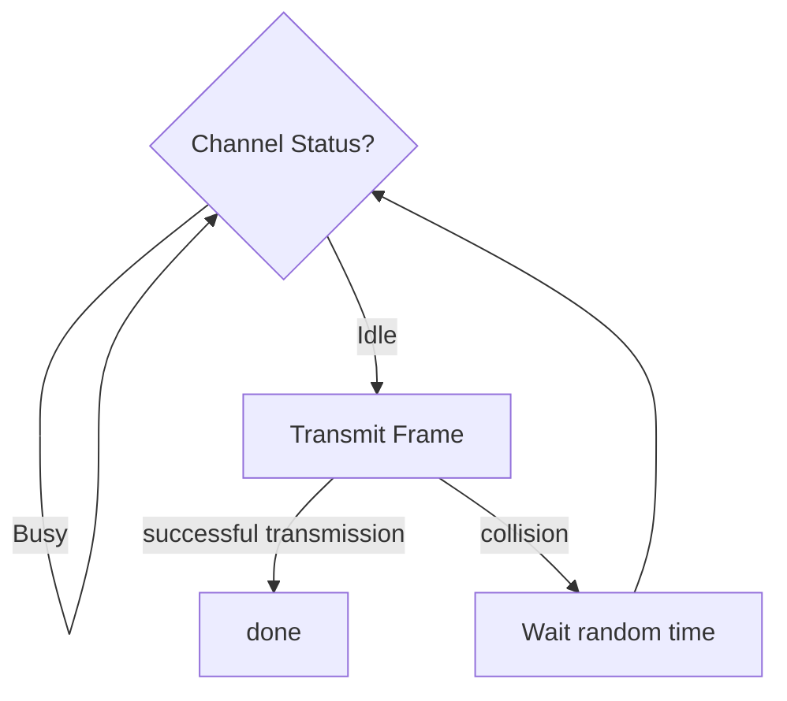
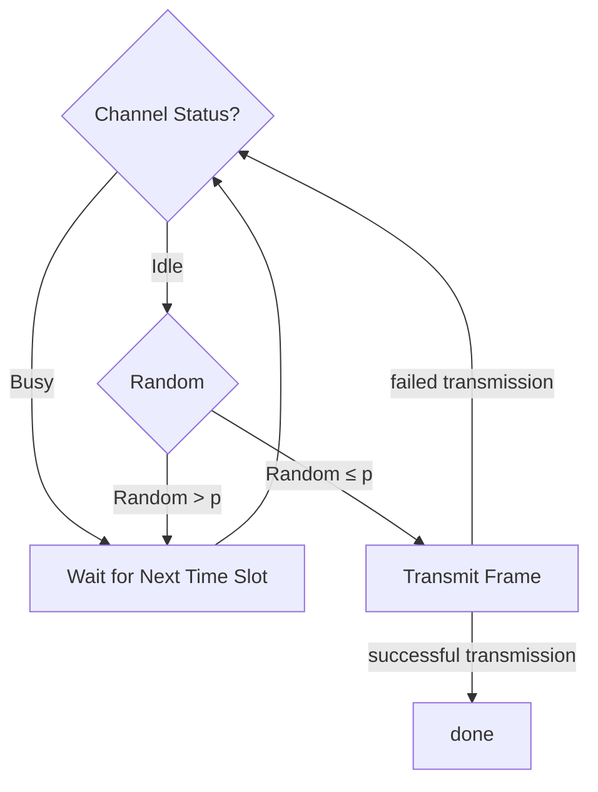
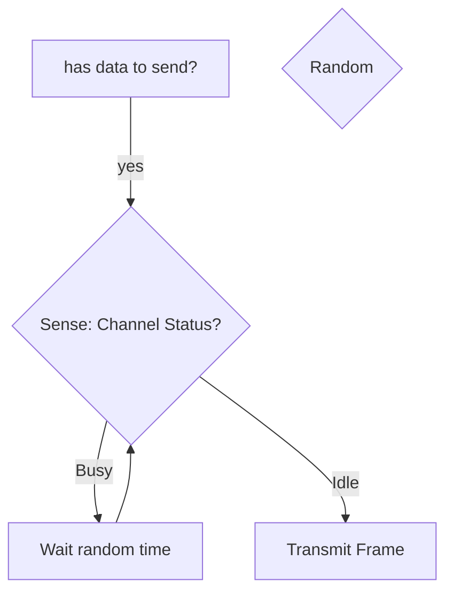

 

# OSI and TCP/IP models

<table border="1">
  <thead>
    <tr>
      <th></th>
      <th>OSI</th>
      <th>TCP/IP</th>
      <th></th>
    </tr>
  </thead>
  <tbody>
    <tr>
      <td>Data</td>
      <td>Application</td>
      <td style="vertical-align: middle;" align="center" rowspan="3">Application</td>
      <td style="vertical-align: middle;" align="center" rowspan="3">Software</td>
    </tr>
    <tr>
      <td>Data</td>
      <td>Presentation</td>
    </tr>
    <tr>
      <td>Data</td>
      <td>Session</td>
    </tr>
    <tr>
      <td>Segment</td>
      <td align="center" colspan="2">Transport <small>(תעבורה, תובלה)</small></td>
      <td>Hardware/Software</td>
    </tr>
    <tr>
      <td>Packet</td>
      <td>Network</td>
      <td>Internet <small>(or Network)</small></td>
      <td style="vertical-align: middle;" align="center" rowspan="3">Hardware</td>
    </tr>
    <tr>
      <td>Frame</td>
      <td>Data Link <small>(קו)</small></td>
      <td style="vertical-align: middle;" align="center" rowspan="2">Link <small>(or Network Access) (קשר, ערוץ)</small></td>
    </tr>
    <tr>
      <td>Bit</td>
      <td>Physical</td>
    </tr>
  </tbody>
</table>


# Link layer

- Link Classification
	- Last-Mile
	- Backbone
	- LAN


- Connection-oriented service
- Connection-less service


## Framing 

- A **frame** 

#### Point-to-Point Protocol (PPP)

Byte-Oriented

<table>
  <tr>
    <th align="center">1 byte</th>
    <th align="center">1</th>
    <th align="center">1</th>
    <th align="center">2</th>
    <th align="center"></th>
    <th align="center">2</th>
    <th align="center">1 byte</th>
  </tr>
  <tr>
    <td align="center">Flag (0x7E)</td>
    <td align="center">Address (0xFF)</td>
    <td align="center">Control (0x03)</td>
    <td align="center">Protocol</td>
    <td align="center">Information (payload)</td>
    <td align="center">FCS (Frame Check Sequence)</td>
    <td align="center">Flag (0x7E)</td>
  </tr>
  <tr>
    <td align="center"></td>
    <td align="center" colspan="3">Header</td>
    <td align="center">Data</td>
    <td align="center">Footer</td>
    <td align="center"></td>
  </tr>
</table>


- Link Control Protocol (LCP)

#### High-Level Data Link Control (HDLC)

bit-oriented

## Error detection and correction


- A **message** (סיביות מידע, מילת מידע) $M$ of length $m$.
- **Redundant bits** (סיביות ביקורת) $R=f(M)$ of length $r$ (where $r \ll m$). 
- The sender transmits the **codeword** (מילת קוד) $P = (M,R)$ of length $n=m+r$. 
- The receiver receives $(M',R')$ and checks if $R' = f(M')$, if yes, assume no error with high probability, else, error detected.
- (**code rate**) $R_{c}=\frac{m}{n}$
- (**overhead**, תקורה) $\frac{r}{n}$
- (**redundancy**) $\frac{r}{m}$ 

- A **bit error** is when a bit is received incorrectly (0 instead of 1 or vice versa)
- A **burst error** is when a sequence of bits is received incorrectly
- (**bit error ratio**) $\displaystyle\text{BER} = \frac{\text{\# bit errors}}{\text{Total transmitted bits}}$
- (**bit error probability**) $p_{e}=\mathrm{E}[\text{BER}]$


נצילות השידור
### parity checks 


- even parity: $R = 0$ if number of 1s in $M$ is even, else $R = 1$
- odd parity: $R = 0$ if number of 1s in $M$ is odd, else $R = 1$
- two-dimensional parity check: $$\begin{array}{ccc|c} b_{1,1} & \cdots & b_{1,j} & r_1 \\ b_{2,1} & \cdots & b_{2,j} & r_2 \\ \vdots & \ddots & \vdots & \vdots \\ b_{i,1} & \cdots & b_{i,j} & r_i \\ \hline c_1 & \cdots & c_j & p \end{array}$$
	- $M$ is an $i \times j$ matrix of bits $b_{m,n}$
	- row parity bits $r_m$ for each row $m$
	- column parity bits $c_n$ for each column $n$
	- overall parity bit $p$

### internet checksum

(note: used in IP, not used in link layer)

- message is divided into words of 16 bits: $w_1, w_2, \ldots, w_m$
- the checksum is $R = \sim(w_1 + w_2 + \ldots + w_m)$ (where $\sim$ is the bitwise NOT operation. The sum is done using [[Data Storage#Ones' complement|ones' complement addition]])
- the sender sends $(M,R)$
- the receiver computes $S = w_1' + w_2' + \ldots + w_m' + R'$ (using ones' complement addition) and checks if $\sim S = 0$, if yes, assume no error, else, error detected


### cyclic redundancy check (CRC)

- the message has $n+1$ bits
- $G(x)$ is the **generator polynomial** of degree $k$
- $M(x)$ is the **message polynomial** of degree $\text{deg}(M) \leq n$
- the transmitted word will be a polynomial $T(x)$ of degree $n+k$ such that $G(x) \mid T(x)$.
- $T(x)$ construction: 
	1. multiply $M(x)$ by $x^k$ to get $M'(x) = M(x) \cdot x^k$
	2. divide $M'(x)$ by $G(x)$ to get the remainder $R(x)$
	3. compute $T(x) = M'(x) - R(x)$
- the receiver receives $T'(x)=T(x)+E(x)$ where $E(x)$ is the **error polynomial** (non-zero coefficients indicate bit errors)
- the receiver checks if $G(x) \mid T'(x)$, if yes, it means that $E(x)=0$ (no error), else, error detected

<iframe width="100%" height="500" src="https://adielbm.github.io/crc-calculator/" frameborder="0"></iframe>

## Reliable Transmission protocols 
### Stop-and-wait ARQ


```
sender:
	n = 0 
	while true:
		send frame[n]
		if ack[n] received within T time:
			n = n + 1
		else: # timeout, we start over

receiver: 
	expected = 0
	while true:
		receive frame[n]
		if n == expected:
			deliver data to upper layer
			expected = expected + 1
		send ack[n]
		
```

### Sliding window protocol

- sender:
	- constants:
		- SWS: send window size
	- variables:
		- LFS: last frame sent
		- LAR: last frame acknowledged
	- invariant: 
		- $\textsf{LFS} - \textsf{LAR} \leq \textsf{SWS}$
	- algorithm:
		- if ack for frame k received and $k > \textsf{LAR}$:
			- set $\textsf{LAR} = k$
		- if $\textsf{LFS} - \textsf{LAR} < \textsf{SWS}$: 
			- send frame $\textsf{LFS}+1$
			- increment $\textsf{LFS}$
		- if timeout for frame k:
			- resend frame k
		- 
- receiver:
	- constants:
		- RWS: receive window size, s.t. $\textsf{RWS} \leq \textsf{SWS}$ 
	- variables:
		- LAF: last acceptable frame
		- LFR: last frame received
	- invariant:
		- $\textsf{LAF} - \textsf{LFR} \leq \textsf{RWS}$


- $\textsf{SWS} < \frac{1}{2} \times (\text{MaxSeqNum}+1)$ 


- negative acknowledgment
	- 
- selective acknowledgments 
	- the receiver could acknowledge exactly those frames it has received rather than just the highest numbered frame received in order

## Ethernet

### Frame format (Ethernet II)

<table>
  <tr>
    <th align="center">8 bytes</th>
    <th align="center">6</th>
    <th align="center">6</th>
    <th align="center">2</th>
    <th align="center">46-1500</th>
    <th align="center">4</th>
  </tr>
  <tr>
    <td align="center">Preamble</td>
    <td align="center">Dest addr</td>
    <td align="center">Src addr</td>
    <td align="center">EtherType</td>
    <td align="center">Payload</td>
    <td align="center">CRC</td>
  </tr>
  <tr>
    <td align="center"></td>
    <td align="center" colspan="3">Header</td>
    <td align="center">Data</td>
    <td align="center">Footer</td>
  </tr>
</table>

#### MAC address

<table style="font-family: monospace;">
  <tr>
    <th align="center" colspan="2">MAC address<br><small>(12 hex digits = 6 bytes = 48 bits)</small></th>
  </tr>
  <tr>
    <td align="center" colspan="2">XX:XX:XX:XX:XX:XX</td>
  </tr>
  <tr>
    <td  align="center" >XX:XX:XX</td>
    <td  align="center" >XX:XX:XX</td>
  </tr>
  <tr>
    <td  align="center" >OUI<br><small>(Organizationally Unique Identifier)</small></td>
    <td  align="center" >NIC<br><small>(Device Identifier)</small></td>
  </tr>
</table>

- **unicast address**: 
- **broadcast address**: FF:FF:FF:FF:FF:FF = all 1s
	- an adpaptor will pass all frames addressed to this address up to host
- **multicast address**: the first bit is 1 but the address is not the broadcast address
	- an adpaptor can be configured to accept frames addressed to set of multicast addresses

- Ethernet adaptor receives all frames, but accepts only:
	- frames addressed to its unicast address
	- frames addressed to the broadcast address
	- frames addressed to multicast addresses it is configured to accept
	- (all frames if in **promiscuous mode**)


# CSMA

- **Carrier Sense Multiple Access** (CSMA)
	- CSMA/CD (Collision Detection)
	- CSMA/CA (Collision Avoidance)


- backoff time = $k\times \text{slot time}$,
	- $k$ is a random integer in $[0, 2^n - 1]$
	- $n$ is the number of collisions for the frame (up to a maximum value, e.g., 10)
	- slot time is the time to transmit 512 bits (minimum Ethernet frame size) (51.2 μs for 10 Mbps Ethernet, 5.12 μs for 100 Mbps Fast Ethernet, 0.512 μs for 1 Gbps Gigabit Ethernet)

#### access methods

##### 1-persistent 



##### p-persistent 



##### non-persistent



